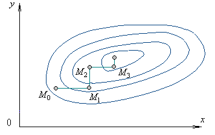

# РСХД Лабораторная работа №1

## Вариант 25867
## Задание:

```
Этап 1. Инициализация кластера БД

    Директория кластера: $HOME/wzo28
    Кодировка: ANSI1251
    Локаль: русская
    Параметры инициализации задать через переменные окружения

Этап 2. Конфигурация и запуск сервера БД

    Способы подключения: 1) Unix-domain сокет в режиме peer; 2) сокет TCP/IP, принимать подключения к любому IP-адресу узла
    Номер порта: 9867
    Способ аутентификации TCP/IP клиентов: по имени пользователя
    Остальные способы подключений запретить.
    Настроить следующие параметры сервера БД:
        max_connections
        shared_buffers
        temp_buffers
        work_mem
        checkpoint_timeout
        effective_cache_size
        fsync
        commit_delay
    Параметры должны быть подобраны в соответствии с аппаратной конфигурацией:
    оперативная память 2ГБ, хранение на твердотельном накопителе (SSD).
    Директория WAL файлов: $PGDATA/pg_wal
    Формат лог-файлов: .log
    Уровень сообщений лога: INFO
    Дополнительно логировать: завершение сессий и продолжительность выполнения команд

Этап 3. Дополнительные табличные пространства и наполнение базы

    Создать новое табличное пространство для индексов: $HOME/exs68
    На основе template1 создать новую базу: illgreennews
    Создать новую роль, предоставить необходимые права, разрешить подключение к базе.
    От имени новой роли (не администратора) произвести наполнение ВСЕХ созданных баз тестовыми наборами данных. ВСЕ табличные пространства должны использоваться по назначению.
    Вывести список всех табличных пространств кластера и содержащиеся в них объекты.
```

## Этап 1

### Добавляем переменные окружения и инициализируем кластер:

```bash
export PGDATA=$HOME/wzo28
export LC_ALL=ru_RU.CP1251
# export LC_ALL=ru_RU.UTF-8
initdb
```

## Этап 2

### Создаём тестовую базу данных для бенчмарка и настройки параметров конфигурации

```bash
psql -h 127.0.0.1 -p 9867 -U postgres2 -d postgres -c "DROP DATABASE IF EXISTS bench_test2;"

psql -h 127.0.0.1 -p 9867 -U postgres2 -d postgres -c "
  CREATE DATABASE bench_test2 
  WITH TEMPLATE = template0 
  ENCODING = 'SQL_ASCII' 
  LC_COLLATE = 'ru_RU.CP1251' 
  LC_CTYPE = 'ru_RU.CP1251';
"

pgbench -h 127.0.0.1 -p 9867 -U postgres2 -i --scale=10 bench_test2
```

### Выполняем скрипт, который подбирает параметры методом покоординатного спуска

```bash
export PGDATA="$HOME/wzo28"
export PGHOST="127.0.0.1"
export PGPORT="9867"
export PGUSER="postgres2"
export DBNAME="bench_test2"
export CONF_FILE="$PGDATA/postgresql.conf"
export LOG_FILE="$HOME/optimization_full_log.txt"

MAX_ITERATIONS=25
BENCH_DURATION=15
MEMORY_LIMIT_KB=1572864

CUR_SHARED_BUFFERS=512
CUR_WORK_MEM=8
CUR_MAX_CONN=20
CUR_EFFECTIVE_CACHE=1536
CUR_CHECKPOINT=30
CUR_COMMIT_DELAY=0
CUR_TEMP_BUFFERS=16
CUR_FSYNC=on

log() {
    echo "[$(date '+%Y-%m-%d %H:%M:%S')] $1" | tee -a "$LOG_FILE"
}

update_param() {
    local param=$1
    local value=$2
    local unit=$3
    sed -i '' "s|^#*[[:space:]]*${param}[[:space:]]*=.*|${param} = ${value}${unit}|" "$CONF_FILE"
}

check_memory() {
    local shared_kb=$(($CUR_SHARED_BUFFERS * 1024))
    local work_total_kb=$(($CUR_MAX_CONN * $CUR_WORK_MEM * 1024))
    local temp_total_kb=$(($CUR_MAX_CONN * $CUR_TEMP_BUFFERS * 1024))
    local total=$((shared_kb + work_total_kb + temp_total_kb))
    [ $total -gt $MEMORY_LIMIT_KB ] && return 1
    return 0
}

measure_score() {
    pg_ctl -D "$PGDATA" -m fast restart > /dev/null 2>&1
    sleep 4
    if ! pg_ctl -D "$PGDATA" status > /dev/null 2>&1; then
        echo "0"
        return
    fi
    local out
    out=$(pgbench -h "$PGHOST" -p "$PGPORT" -U "$PGUSER" -c 8 -j 4 -T "$BENCH_DURATION" "$DBNAME" 2>/dev/null)
    local tps
    tps=$(echo "$out" | grep "tps =" | awk '{print $3}')
    [ -z "$tps" ] && tps="0"
    echo "$tps"
}

is_greater() {
    awk -v a="$1" -v b="$2" 'BEGIN { exit (a > b ? 0 : 1) }'
}

apply_config() {
    update_param "shared_buffers" "$CUR_SHARED_BUFFERS" "MB"
    update_param "work_mem" "$CUR_WORK_MEM" "MB"
    update_param "max_connections" "$CUR_MAX_CONN" ""
    update_param "effective_cache_size" "$CUR_EFFECTIVE_CACHE" "MB"
    update_param "checkpoint_timeout" "$CUR_CHECKPOINT" "min"
    update_param "commit_delay" "$CUR_COMMIT_DELAY" ""
    update_param "temp_buffers" "$CUR_TEMP_BUFFERS" "MB"
    update_param "fsync" "$CUR_FSYNC" ""
}

echo "" > "$LOG_FILE"
log "=== Полная оптимизация (8 параметров) ==="
log "Старт: shared_buffers=${CUR_SHARED_BUFFERS}MB, work_mem=${CUR_WORK_MEM}MB, max_connections=${CUR_MAX_CONN}"

apply_config
BASE_SCORE=$(measure_score)
log "Базовый TPS: $BASE_SCORE"

BEST_SCORE=$BASE_SCORE
ITERATION=1

while [ $ITERATION -le $MAX_ITERATIONS ]; do
    log "--- Итерация $ITERATION ---"
    LOCAL_BEST_SCORE=$BASE_SCORE
    LOCAL_BEST_PARAM=""
    LOCAL_BEST_VAL=""
    
    PARAMS="shared_buffers:$CUR_SHARED_BUFFERS:128:MB work_mem:$CUR_WORK_MEM:2:MB max_connections:$CUR_MAX_CONN:5: effective_cache_size:$CUR_EFFECTIVE_CACHE:256:MB checkpoint_timeout:$CUR_CHECKPOINT:5:min commit_delay:$CUR_COMMIT_DELAY:500: temp_buffers:$CUR_TEMP_BUFFERS:4:MB"
    
    for p in $PARAMS; do
        NAME=$(echo "$p" | cut -d: -f1)
        VAL=$(echo "$p" | cut -d: -f2)
        STEP=$(echo "$p" | cut -d: -f3)
        UNIT=$(echo "$p" | cut -d: -f4)
        
        for SIGN in 1 -1; do
            NEW_VAL=$((VAL + (STEP * SIGN)))
            [ "$NEW_VAL" -lt 0 ] && NEW_VAL=0
            
            OLD_SHARED=$CUR_SHARED_BUFFERS
            OLD_WORK=$CUR_WORK_MEM
            OLD_CONN=$CUR_MAX_CONN
            OLD_CACHE=$CUR_EFFECTIVE_CACHE
            OLD_CHECKPOINT=$CUR_CHECKPOINT
            OLD_COMMIT=$CUR_COMMIT_DELAY
            OLD_TEMP=$CUR_TEMP_BUFFERS
            
            case $NAME in
                "shared_buffers") CUR_SHARED_BUFFERS=$NEW_VAL ;;
                "work_mem") CUR_WORK_MEM=$NEW_VAL ;;
                "max_connections") CUR_MAX_CONN=$NEW_VAL ;;
                "effective_cache_size") CUR_EFFECTIVE_CACHE=$NEW_VAL ;;
                "checkpoint_timeout") CUR_CHECKPOINT=$NEW_VAL ;;
                "commit_delay") CUR_COMMIT_DELAY=$NEW_VAL ;;
                "temp_buffers") CUR_TEMP_BUFFERS=$NEW_VAL ;;
            esac
            
            if ! check_memory; then
                CUR_SHARED_BUFFERS=$OLD_SHARED
                CUR_WORK_MEM=$OLD_WORK
                CUR_MAX_CONN=$OLD_CONN
                CUR_EFFECTIVE_CACHE=$OLD_CACHE
                CUR_CHECKPOINT=$OLD_CHECKPOINT
                CUR_COMMIT_DELAY=$OLD_COMMIT
                CUR_TEMP_BUFFERS=$OLD_TEMP
                continue
            fi
            
            apply_config
            log "Тест: $NAME=$NEW_VAL$UNIT"
            
            SCORE=$(measure_score)
            log "Результат: $SCORE TPS"
            
            if is_greater "$SCORE" "$LOCAL_BEST_SCORE"; then
                LOCAL_BEST_SCORE=$SCORE
                LOCAL_BEST_PARAM=$NAME
                LOCAL_BEST_VAL=$NEW_VAL
                BASE_SCORE=$SCORE
            else
                CUR_SHARED_BUFFERS=$OLD_SHARED
                CUR_WORK_MEM=$OLD_WORK
                CUR_MAX_CONN=$OLD_CONN
                CUR_EFFECTIVE_CACHE=$OLD_CACHE
                CUR_CHECKPOINT=$OLD_CHECKPOINT
                CUR_COMMIT_DELAY=$OLD_COMMIT
                CUR_TEMP_BUFFERS=$OLD_TEMP
                apply_config
            fi
        done
    done
    
    if [ -n "$LOCAL_BEST_PARAM" ]; then
        log "Улучшение: $LOCAL_BEST_PARAM=$LOCAL_BEST_VAL (TPS: $LOCAL_BEST_SCORE)"
        apply_config
    else
        log "Локальный максимум достигнут"
        break
    fi
    
    ITERATION=$((ITERATION + 1))
done

log "Завершенo"
log "Лучший TPS: $BEST_SCORE"
```

***лог можно посмотреть по [тут](https://github.com/romboooo/rshd_lab1/blob/main/02-bd-config/optimization_full_log.txt)***

### Как это работает?

```
Покоординатный спуск (метод Гаусса — Зейделя)
— это итерационный алгоритм оптимизации, который находит минимум функции нескольких переменных, поочередно минимизируя ее по одной координате (переменной) за раз, фиксируя остальные.
```



***псевдокод***
```python
params = {name: val, step, limit for ...}
best_score = measure()

for iteration in range(MAX_ITER):
    improved = False
    
    for name, cfg in params.items():
        for direction in [1, -1]:
            old_val = cfg.val
            cfg.val += cfg.step * direction
            
            if cfg.val < 0 or check_memory(params) > LIMIT:
                cfg.val = old_val
                continue
            
            apply_config(params)
            score = measure()
            
            if score > best_score:
                best_score = score
                improved = True
            else:
                cfg.val = old_val
                apply_config(params)
    
    if not improved:
        break
```


## Полученные результаты
| Параметр | Значение | Описание
| :---: | :---: | :---: |
| shared_buffers | 384MB | объём памяти, который будет использовать сервер баз данных для буферов в разделяемой памяти.
| work_mem | 6MB | базовый максимальный объём памяти, который будет использоваться во внутренних операциях при обработке запросов 
| max_connections | 25 |  максимальное число одновременных подключений к серверу БД |
| fsync | on | Если этот параметр установлен, сервер Postgres Pro старается добиться, чтобы изменения были записаны на диск физически, выполняя системные вызовы fsync()
| checkpoint_timeout | 35min | Максимальное время между автоматическими контрольными точками в WAL.
| commit_delay | 500  | Параметр commit_delay определяет, на сколько микросекунд будет засыпать ведущий процесс группы, записывающий в журнал, после получения блокировки в XLogFlush, пока подчинённые формируют очередь на запись.
| temp_buffers | 20MB |  максимальный объём памяти, выделяемой для временных буферов в каждом сеансе. 
| effective_cache_size | 1536MB | Укажите параметр конфигурации effective_cache_size, чтобы определить предположение планировщика об эффективном размере дискового кеша, доступном для одного запроса. (effective_cache_size = ОЗУ - shared_buffers)
| random_page_cost | 1.1 | Укажите параметр конфигурации random_page_cost, чтобы определить приблизительную стоимость чтения одной произвольной страницы с диска. | 
| effective_io_concurrency | 200 | Укажите количество одновременных операций ввода-вывода на диск, которое каждый отдельный сеанс Postgres Pro пытается выполнять параллельно. 


### добавим в postgresql.conf

```bash
[postgres2@pg101 ~]$ cat ~/wzo28/postgresql.conf
listen_addresses = '*'
port = 9867
unix_socket_directories = '/tmp'

shared_buffers = 384MB
work_mem = 6MB
temp_buffers = 20MB
effective_cache_size = 1536MB
max_connections = 25

fsync = on
checkpoint_timeout = 35min
commit_delay = 500
wal_buffers = 64MB

log_destination = 'stderr'
logging_collector = on
log_directory = 'log'
log_filename = 'postgresql-%Y-%m-%d_%H%M%S.log'
log_min_messages = info
log_disconnections = on
log_duration = on

# ssd приколы
random_page_cost = 1.1
effective_io_concurrency = 200
```

### а также настроим аутентификацию на основе узла

### pg_hba.config

```bash
[postgres2@pg101 ~]$ cat ~/wzo28/pg_hba.conf
# TYPE  DATABASE        USER            ADDRESS                 METHOD
local   all             all                                     peer
host    all             all             0.0.0.0/0               password
host    all             all             ::/0                    password
[postgres2@pg101 ~]$
```

### Посмотреть логи
```bash
[postgres2@pg101 ~]$ ls $PGDATA/log
```

### Финальная проверка производительности

```bash
[postgres2@pg101 ~]$ pgbench -h 127.0.0.1 -p 9867 -U postgres2 -c 8 -j 4 -T 30 bench_test2
```

```bash
pgbench (16.4)
starting vacuum...end.
transaction type: <builtin: TPC-B (sort of)>
scaling factor: 10
query mode: simple
number of clients: 8
number of threads: 4
maximum number of tries: 1
duration: 30 s
number of transactions actually processed: 4649
number of failed transactions: 0 (0.000%)
latency average = 54.169 ms
initial connection time = 43.564 ms
tps = 147.686373 (without initial connection time)
```


## Этап 3

### создадим tablespace
```sql
CREATE TABLESPACE exs68 LOCATION '/var/db/postgres2/exs68';
```
### создадим новую роль 

```sql
CREATE ROLE rmb WITH LOGIN PASSWORD 'admin';
```

### создадим на него базу и выдадим GRANT

```sql
CREATE DATABASE illgreennews TEMPLATE template1 OWNER rmb;

GRANT CONNECT ON DATABASE illgreennews TO rmb;

GRANT CREATE ON TABLESPACE eks68 TO rmb;
```

### зайдём от него в новую бд и создадим таблицы

```bash
psql -h 127.0.0.1 -p 9867 -U rmb -d illgreennews
```

```sql
CREATE TABLE articles (
    id SERIAL PRIMARY KEY,
    title TEXT NOT NULL,
    content TEXT,
    created_at TIMESTAMP DEFAULT now()
);

CREATE TABLE comments (
    id SERIAL,  
    article_id INTEGER REFERENCES articles(id),
    author TEXT,
    body TEXT
);
```

```bash
illgreennews=> \dt
            Список отношений
 Схема  |   Имя    |   Тип   | Владелец
--------+----------+---------+----------
 public | articles | таблица | rmb
 public | comments | таблица | rmb
(2 строки)

illgreennews=>
```

### создадим индекс для новых таблиц

```sql
CREATE INDEX idx_comments_article ON comments(article_id) TABLESPACE eks68;
```

```
      indexname       | tablename | tablespace
----------------------+-----------+------------
 idx_comments_article | comments  | eks68
(1 строка)

illgreennews=>
```

### заполним таблицу данными

```sql
INSERT INTO articles (title, content) VALUES
    ('Тема 1', 'Описание статьи номер 1'),
    ...
    ...
    ...
    ('Тема 100', 'Описание статьи номер 100');
```

```sql
INSERT INTO comments (article_id, author, body) VALUES
    (1, 'User1', 'Коммент 1'),
    ...
    ...
    ...
    (1, 'User100', 'Коммент 100');
```

### Проверяем
```sql
SELECT * FROM articles;
SELECT * FROM comments;
```

### Вывести список всех табличных пространств кластера и содержащиеся в них объекты.

```sql
\db+

SELECT 
    n.nspname AS schema,
    c.relname AS object_name,
    CASE c.relkind 
        WHEN 'i' THEN 'INDEX'
        WHEN 'r' THEN 'TABLE'
        ELSE 'OTHER'
    END AS object_type,
    t.spcname AS tablespace
FROM pg_class c
JOIN pg_namespace n ON n.oid = c.relnamespace
JOIN pg_tablespace t ON t.oid = c.reltablespace
WHERE t.spcname = 'eks68';

\c illgreennews
SELECT * FROM articles;
SELECT * FROM comments;
```

# Вывод

```
на выделенном узле я создал и сконфигурировал новый кластер БД Postgres, саму БД, табличные пространства и новую роль, а также произвёл наполнение базы в соответствии с заданием. 
```